# Smart Recruit

Smart Recruit: An Intelligent Decision-Support Tool for High-Volume Hiring.

## 1) Core concept

- Evaluation is always JD-based, not CV-based.
- A candidate score is meaningful only in the context of one specific Job Description.
- One evaluation process = 1 JD + multiple CVs associated with that JD.
- Backend owns business rules, authorization, persistence, and orchestration.

---

## 2) Tech stack

- Backend: Java 21, Spring Boot, Spring Security (JWT), Spring Data JPA
- Frontend: React + Vite + TypeScript + Tailwind CSS
- ML Service: Python + FastAPI
- Database: Supabase PostgreSQL
- Containerization: Docker + Docker Compose

---

## 3) Main features

- JWT authentication and role-based access (`ADMIN`, `RECRUITER`)
- Job Description management
- CV upload/parsing and candidate management
- JD-CV feature engineering and ML scoring
- Evaluation history and ranking by job
- Explainability breakdown by criteria groups:
  - Skills
  - Experience
  - Education
  - Seniority

---

## 4) Monorepo structure

```
backend/    # Spring Boot API + business logic
frontend/   # React application
ml/         # FastAPI inference service
docker-compose.yml  # Full-stack orchestration
```

---

## 5) UI-UX

### Guest (Public Access)

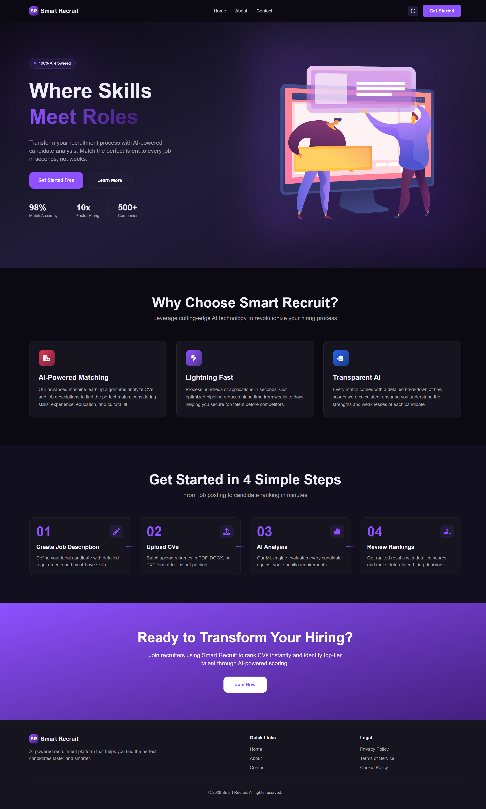

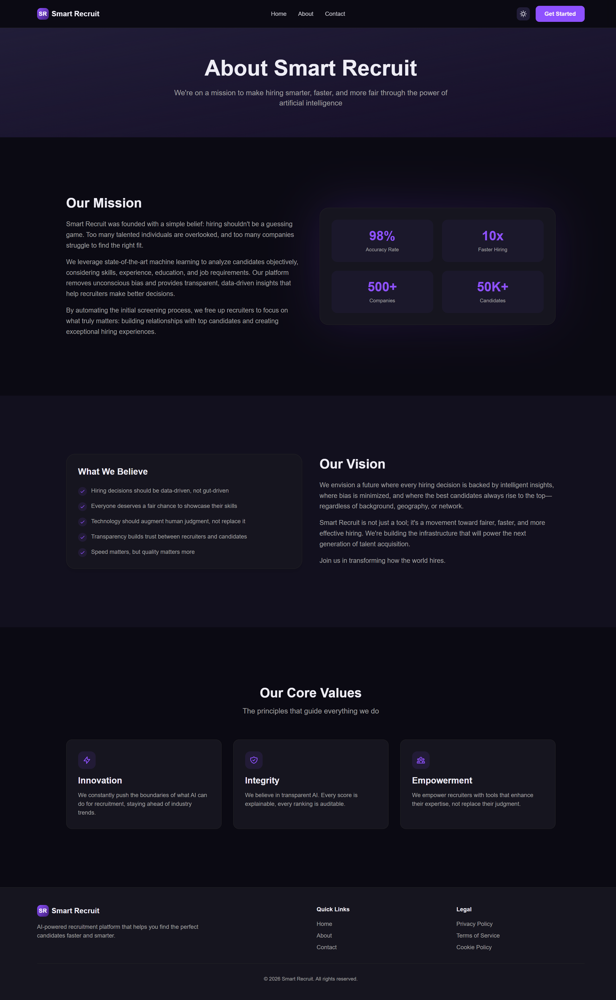

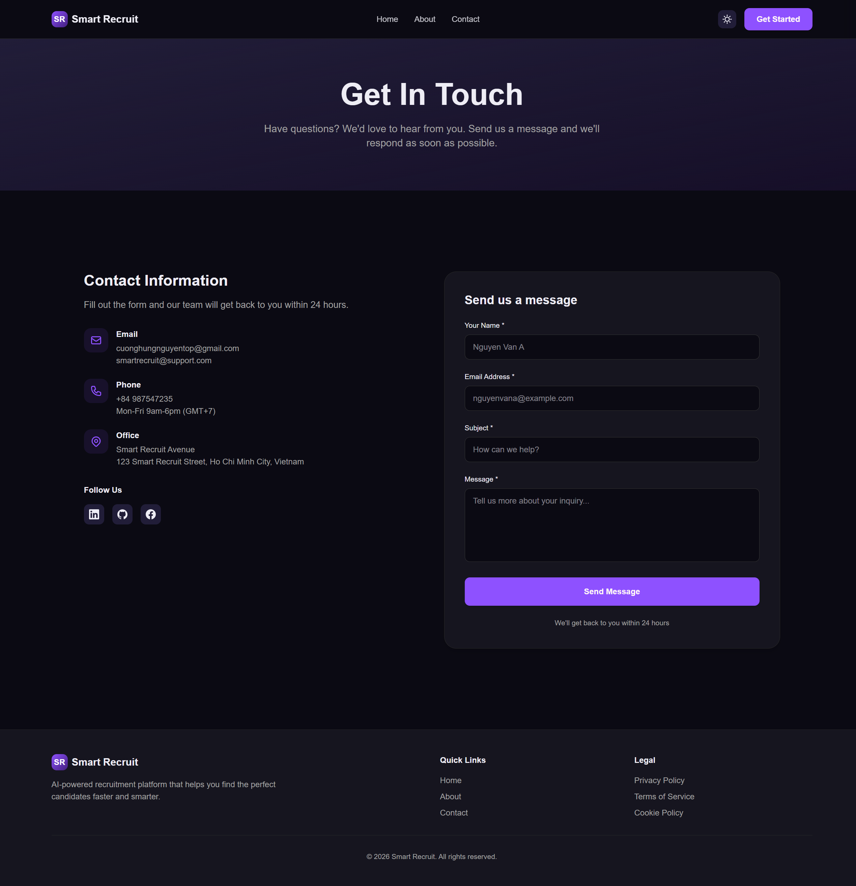

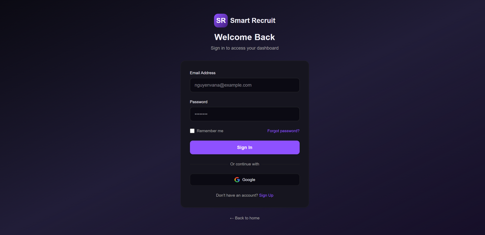

---

### Recruiter Dashboard

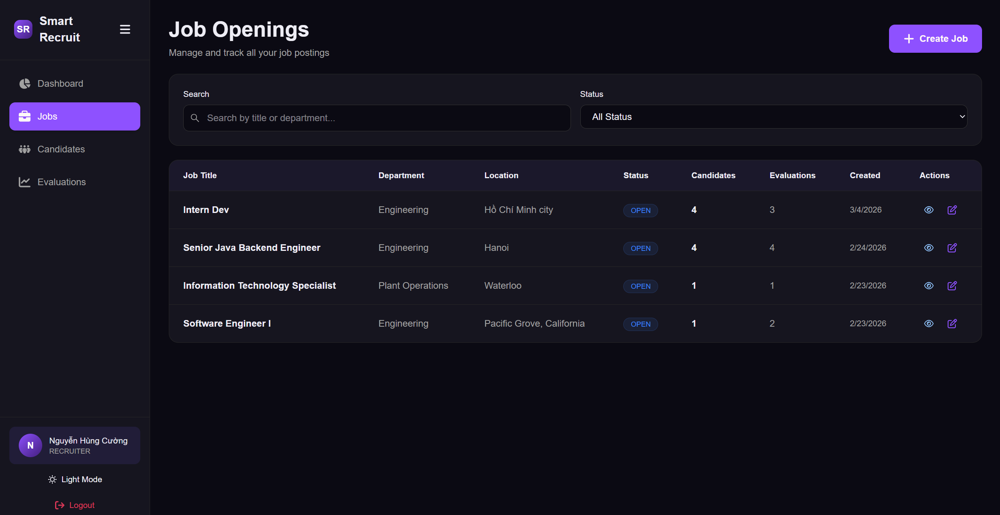

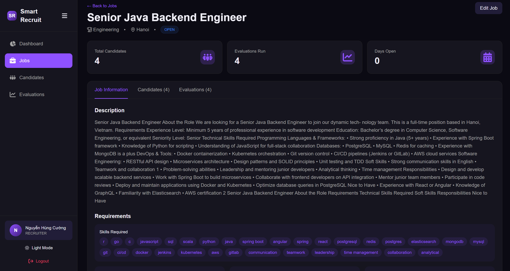

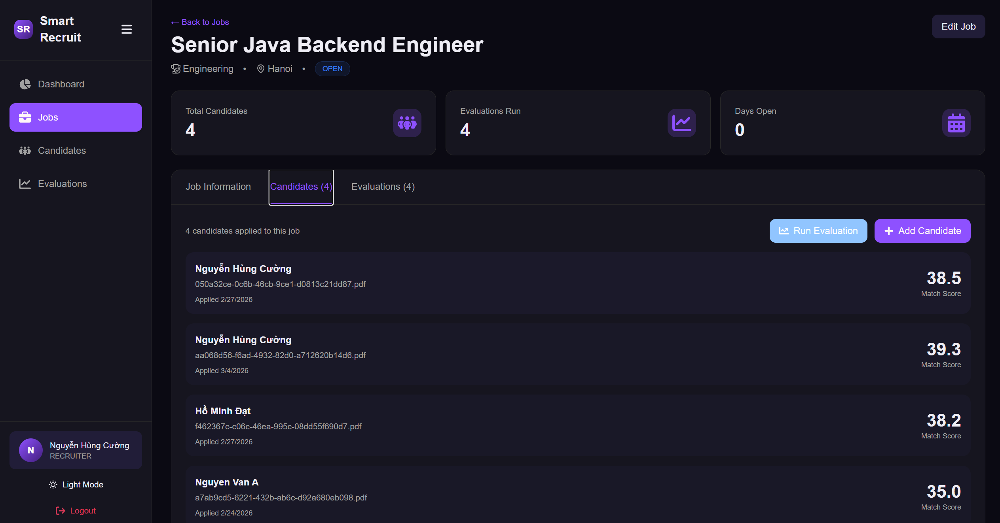

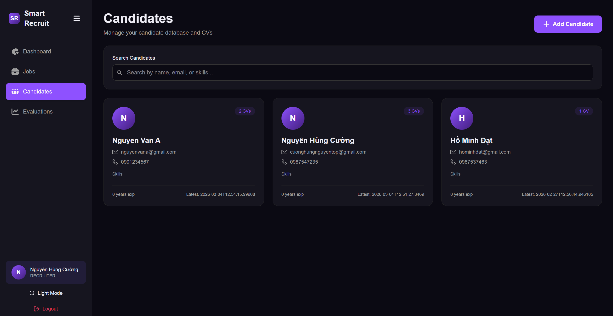

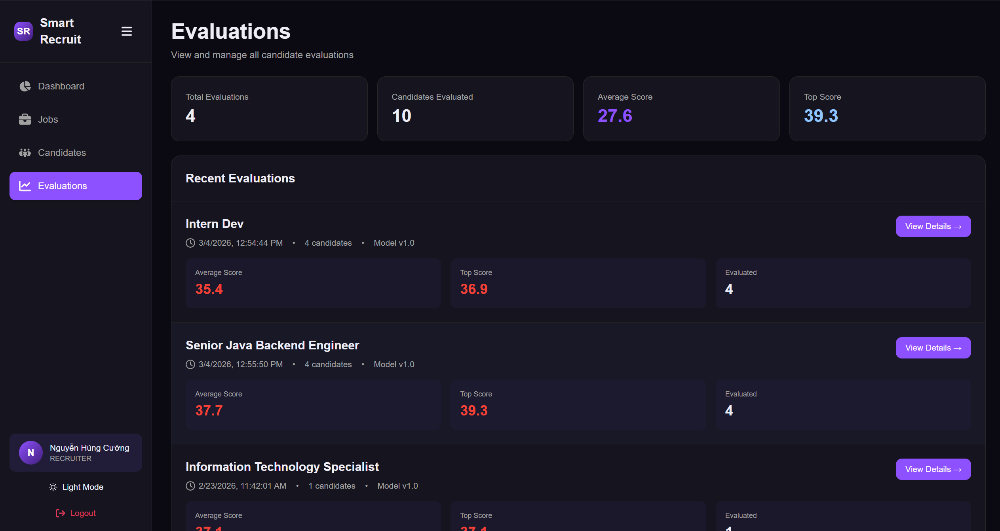

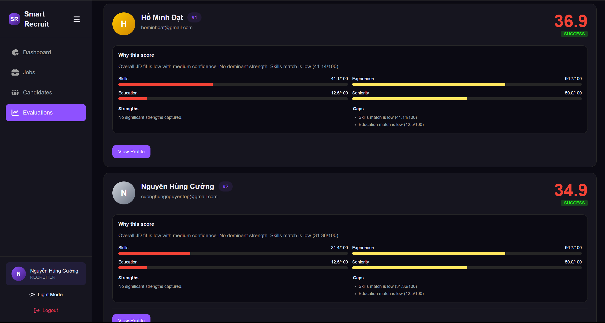

---

### Admin Panel

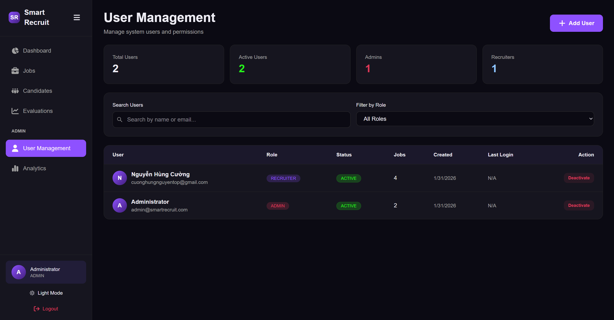

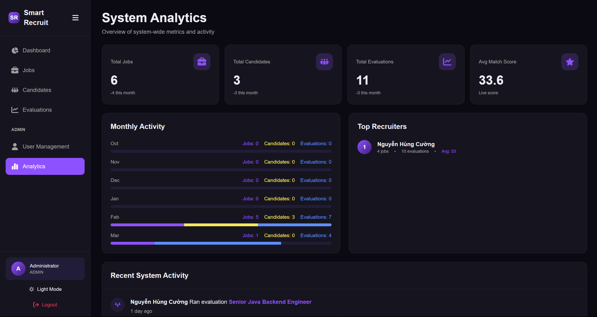

## 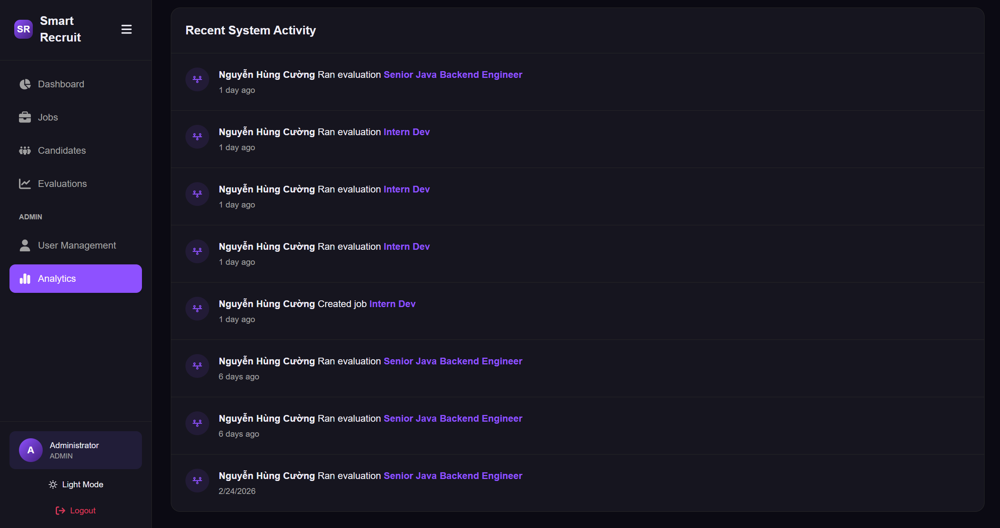

## 6) Run with Docker (recommended)

From repository root:

```bash
docker compose down
docker compose up -d --build
docker compose ps
```

Services:

- Frontend: `http://localhost:5173`
- Backend API: `http://localhost:8080`
- ML Service: `http://localhost:8000`

Follow logs:

```bash
docker compose logs -f backend
docker compose logs -f ml
docker compose logs -f frontend
```

---

## 7) Run locally without Docker

### 7.1 Backend

```bash
cd backend
./mvnw spring-boot:run
```

Windows PowerShell:

```powershell
cd backend
.\mvnw.cmd spring-boot:run
```

### 7.2 ML service

```bash
cd ml
pip install -r requirements-ml-service.txt
python -m ml_service.main
```

### 7.3 Frontend

```bash
cd frontend
npm install
npm run dev
```

---

## 8) Contact

- **Email**: cuonghungnguyentop@gmail.com
- **GitHub Issues**: [https://github.com/NguyenHungCuongg/Deep-Thocks/issues](https://github.com/NguyenHungCuongg/Smart-Recruit/issues)
- **Facebook** : [https://www.facebook.com/cuong.nguyen.813584/](https://www.facebook.com/cuong.nguyen.813584/)
- **Linkedin** : [https://www.linkedin.com/in/c%C6%B0%E1%BB%9Dng-nguy%E1%BB%85n-76153a333/](https://www.linkedin.com/in/c%C6%B0%E1%BB%9Dng-nguy%E1%BB%85n-76153a333/)
